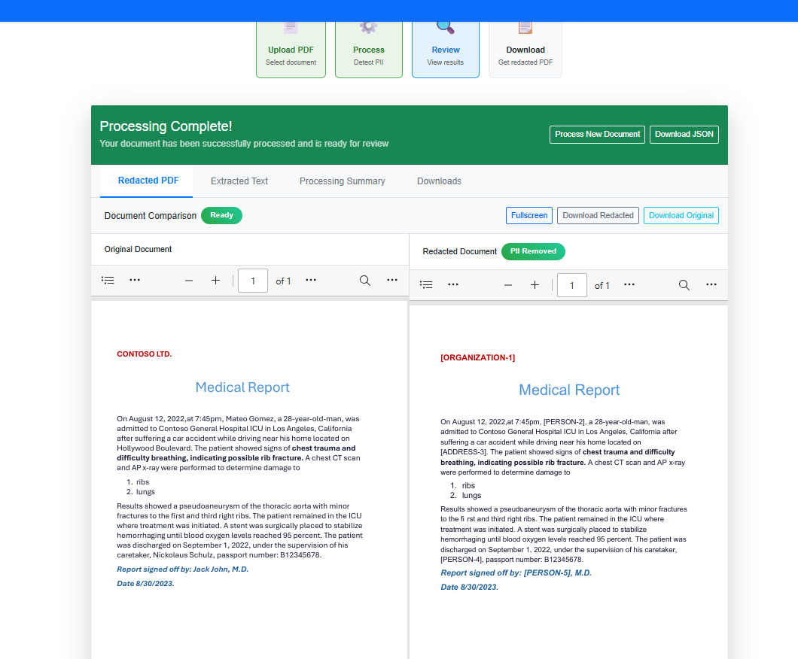

# PII Detection & Redaction Blazor App

**Author:** Koushik Nagarajan ([@element824](https://github.com/element824))  
**Technology:** Blazor Server (.NET 8) + Azure AI Foundry Language Service  
**License:** MIT

---

A modern web application built with Blazor Server for detecting and redacting Personally Identifiable Information (PII) from PDF documents using Azure AI Foundry Language Service.

## 📸 Application Preview



_Side-by-side comparison showing original document (left) and redacted document (right) with PII automatically detected and masked by Azure AI_

## Disclaimer

This sample code is provided for educational and demonstration purposes only. While created by a Microsoft employee based on official Azure AI Services documentation, this repository represents personal work and is not an official Microsoft product or service.

**Important Notes:**

- This code is provided "as-is" without warranty of any kind
- Microsoft does not provide official support for this sample
- Users are responsible for testing and validating the code in their own environments
- Always follow your organization's security and compliance policies when handling PII data
- Ensure proper data governance and privacy compliance (GDPR, CCPA, etc.) when processing personal information

## Prerequisites

- .NET 8.0 SDK
- Azure subscription with:
  - Azure Storage Account
  - Azure AI Foundry Language Service resource (with PII redaction preview features enabled)

## Quick Setup

### 1. Clone and Setup

```bash
git clone <repository-url>
cd pii-redact-doc-blazor-sample
dotnet restore
```

### 2. Configure Azure Credentials

```bash
# Set your Azure Storage connection string
dotnet user-secrets set "ConnectionStrings:AzureStorage" "DefaultEndpointsProtocol=https;AccountName=YOUR_ACCOUNT;AccountKey=YOUR_KEY;EndpointSuffix=core.windows.net"

# Set your Azure AI Language service credentials
dotnet user-secrets set "Azure:LanguageKey" "YOUR_API_KEY"
dotnet user-secrets set "Azure:LanguageEndpoint" "https://YOUR_RESOURCE.cognitiveservices.azure.com"
dotnet user-secrets set "Azure:ApiVersion" "2024-11-15-preview"
```

### 3. Create Storage Containers

Create these containers in your Azure storage account:

- `piisource` - for uploaded PDF documents
- `piitarget` - for redacted PDF documents

### 4. Run the Application

```bash
dotnet run
```

Navigate to `http://localhost:5186`

## Usage

1. Upload a PDF document
2. Click "Process Document" to start PII detection
3. Monitor processing status
4. View and download redacted results

## Features

- **📤 Drag-and-Drop PDF Upload** - Easy document upload with visual feedback
- **⚡ Real-time Processing** - Live progress tracking with status updates
- **🤖 AI-Powered PII Detection** - Azure AI Foundry Language Service integration
- **📋 Side-by-Side Comparison** - View original and redacted documents simultaneously
- **📊 Comprehensive Results** - Multiple output formats (PDF, JSON, Text, Reports)
- **🔒 Secure Azure Integration** - SAS URLs and private container support

## Application Showcase

The application provides a modern, intuitive interface for PII detection and redaction with side-by-side document comparison.

### Key Interface Features:

1. **📊 Progress Tracking** - Visual step-by-step process indicators (Upload → Process → Review → Download)
2. **📑 Tabbed Results Interface** - Clean organization of results across multiple tabs
3. **👁️ Side-by-Side PDF Viewer** - Compare original and redacted documents in real-time
4. **🏷️ Smart PII Detection** - Automatic identification and redaction of sensitive information including:
   - Personal names (PERSON-2) → `[PERSON-2]`
   - Organizations (ORGANIZATION-1) → `[ORGANIZATION-1]`
   - Addresses, phone numbers, dates, and more
5. **💾 Multiple Download Options** - Get results in various formats (PDF, JSON, Text, Report)
6. **🔄 Real-time Status Updates** - Toast notifications and progress indicators

### What Gets Redacted:

The Azure AI service automatically detects and redacts various PII categories:

- **Personal Information**: Names, addresses, phone numbers
- **Medical Information**: Patient details, medical record numbers
- **Financial Data**: Account numbers, credit card information
- **Organizational Data**: Company names, employee IDs
- **Temporal Data**: Dates, times, ages

## Documentation

For detailed information, refer to the official Microsoft documentation:

- [Detect and redact Personally Identifying Information in native documents (preview)](https://learn.microsoft.com/en-us/azure/ai-services/language-service/personally-identifiable-information/how-to/redact-document-pii)
- [Azure AI Foundry Language Service Documentation](https://learn.microsoft.com/en-us/azure/ai-services/language-service/)

---

## Author

**Koushik Nagarajan**  
GitHub: [@element824](https://github.com/element824)  
Software Engineer & AI Solutions Developer

## License

MIT License - Copyright (c) 2025 Koushik Nagarajan

_This project demonstrates the implementation of Azure AI Foundry Language Service's document-level PII redaction capabilities using modern .NET technologies._

**Connect with the author:**  
🔗 GitHub: [@element824](https://github.com/element824)
